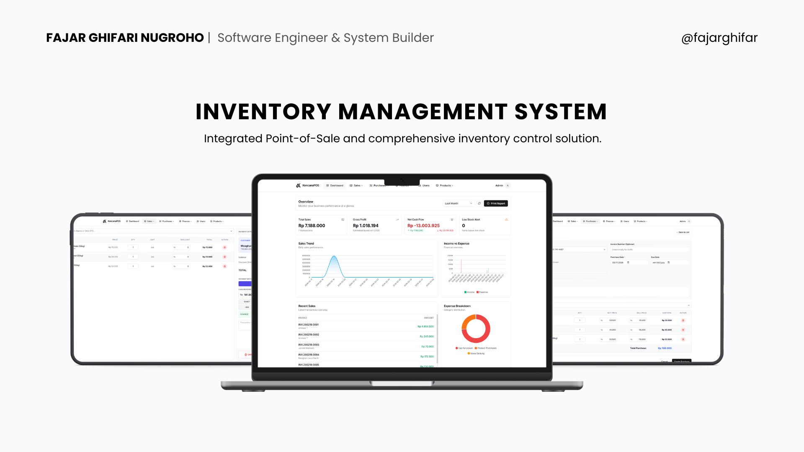

# ✨ Comprehensive Inventory Management System

A robust, enterprise-grade **Inventory Management System** built with **Laravel 12** and **Livewire**. Designed specifically to streamline inventory tracking, sales, purchasing processes, and financial ledger management with dynamic localization.



## 🌟 Key Modules & Features

- **📊 Advanced Analytics Dashboard**
  - Real-time Total Sales & Net Cash Flow tracking.
  - Interactive ApexCharts for Sales & Cash Flow trends.
  - Quick insights: Top Selling Products, Top Customers, and Low Stock Alerts.

- **💳 Sales & POS (Point of Sale)**
  - Fast, intuitive POS interface designed for rapid checkouts.
  - Support for Global Discounts, Exact Cash computation, and Change tracking.
  - Direct integration with Invoice/Receipt printing.
  - Persistent cart state across sessions.

- **📦 Purchases & Receiving**
  - End-to-end Purchase Order workflow.
  - Seamless "Receive Items" action that updates real inventory balances automatically.
  - Supplier tracking and history filtering.

- **🗃️ Master Data Management**
  - **Products**: Manage stock, pricing (Buy/Sell margins), and associations.
  - **Categories & Units**: Structured tagging for efficient reporting.
  - **Customers & Suppliers**: Comprehensive contact books integrated globally.

- **💰 Finance Ledger & Cash Flow**
  - Integrated Double-entry style tracking for all Income and Expenses.
  - Dynamic Cash Flow reporting mapping POS sales to Income and Purchases to Expenses automatically.
  - Custom Income/Expense categorization.

- **⚙️ Dynamic Localization & Settings**
  - Global Store Information management.
  - **Fully Dynamic Currency Framework**: Customizable currency symbols, positions (left/right), thousands separators, decimal separators, and fractional precision. Changes apply globally to charts, tables, inputs, and receipts instantly.

## 🛠️ Tech Stack & Library Used

- **Framework**: Laravel 12.x
- **Frontend/Reactivity**: Laravel Livewire 3 + Alpine.js
- **Styling**: Tailwind CSS (Shadcn-inspired components)
- **Data Tables**: Livewire PowerGrid (with customized AJAX filters)
- **Charts**: ApexCharts
- **Icons**: Blade Heroicons
- **Database**: SQLite

## 🚀 Quick Start

Follow these steps to set up the project locally for development or testing.

### Prerequisites
- PHP 8.2 or higher
- Composer
- Node.js & NPM
- SQLite PHP extension

### Installation Steps

1. **Clone the repository:**
    ```bash
    git clone https://github.com/fajarghifar/inventory-management-system.git
    ```

2. **Navigate to the project folder:**
    ```bash
    cd inventory-management-system
    ```

3. **Install PHP dependencies:**
    ```bash
    composer install
    ```

4. **Copy `.env` configuration:**
    ```bash
    cp .env.example .env
    ```

5. **Generate application key:**
    ```bash
    php artisan key:generate
    ```

6. **Configure your Database:**
    The app uses SQLite by default. Create the local database file if it does not already exist:
    ```bash
    touch database/database.sqlite
    ```

    Then keep the SQLite connection in `.env`:
    ```env
    DB_CONNECTION=sqlite
    DB_DATABASE=database/database.sqlite
    ```

7. **Run database migrations and seeders:**
    This command will migrate all tables and inject default users, settings, products, and categories.
    ```bash
    php artisan migrate:fresh --seed
    ```

8. **Link storage for media/image files:**
    ```bash
    php artisan storage:link
    ```

9. **Install node modules and compile assets:**
    ```bash
    npm install
    npm run build
    ```

10. **Start the Laravel development server:**
    ```bash
    php artisan serve
    ```

11. **Login using the default admin credentials:**
    - **Username:** `admin`
    - **Password:** `password`

## Desktop Installer

The Electron desktop build bundles the Laravel app, production Composer dependencies, compiled frontend assets, and a portable PHP runtime with SQLite enabled. A new machine only needs to run the generated installer.

Build the Windows installer:

```bash
npm install
npm run desktop:dist
```

The installer is written to `dist-desktop`. On first launch, the desktop app creates a private SQLite database in Electron's user data folder, runs migrations, and seeds the default admin account plus base settings/categories. The installed app does not require PHP, Composer, Node.js, MySQL, or any other database server on the target machine.

If you need to override the PHP runtime used during packaging, set `PHP_ZIP_URL` before running `npm run desktop:dist`.

## Render Deployment

This repository includes `Dockerfile`, `docker/start.sh`, and `render.yaml` for Render.

1. Push the repo to GitHub.
2. In Render, create a new Blueprint from the repository.
3. Render will create:
   - Docker web service: `chemsa`
   - PostgreSQL database: `chemsa-postgres`
4. The start script runs migrations and seeds the base data automatically.

Default admin account:

- Username: `admin`
- Password: `chemsadmin11@`

Render uses PostgreSQL through `DATABASE_URL`. The desktop Electron build still uses local SQLite.

## 💡 Contributing

Have ideas to improve the system? Architecture enhancements, UI tweaks, or bug reports are welcome!
- Submit a **Pull Request (PR)**
- Create an **Issue** for feature requests or structural bugs

## 📄 License

Licensed under the [MIT License](LICENSE).

---

> Crafted by [Fajar Ghifar](https://github.com/fajarghifar) &nbsp;&middot;&nbsp; [YouTube](https://www.youtube.com/@fajarghifar) &nbsp;&middot;&nbsp; [Instagram](https://instagram.com/fajarghifar) &nbsp;&middot;&nbsp; [LinkedIn](https://www.linkedin.com/in/fajarghifar/)
